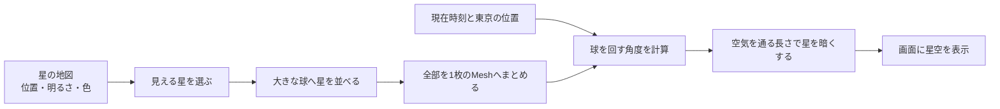
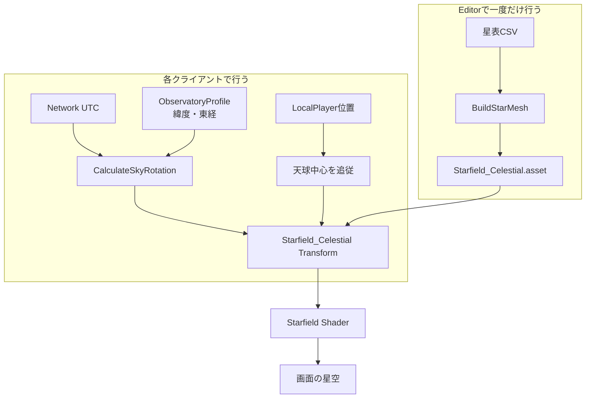
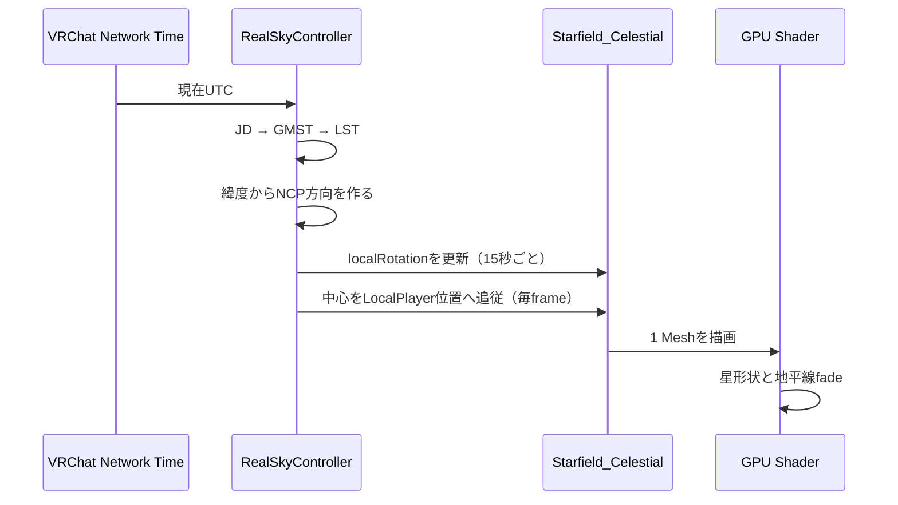

# 星空の作り方 — Stargazing Hill実装ガイド

状態: `Confirmed`

更新日: 2026-08-14

この文書は、Stargazing Hillの「実在恒星を軽量なVRChat向け星空にする方法」を、最初に簡単に、その後に数式とコード単位で説明する。固定値・精度基準・月・流星群を含むシステム全体の正本は [REAL_SKY_SYSTEM.md](REAL_SKY_SYSTEM.md) とし、この文書は恒星背景の理解と再実装を助ける説明書とする。

## 簡易説明

この簡易説明は、中高生でも流れを追えるよう、巨大なプラネタリウムにたとえて説明する。

まず、星の名前・位置・明るさ・色が書かれた「星の地図」を用意する。その地図を見ながら、内側から見上げる大きな球に星のシールを貼るように、小さな光の点を並べる。星を12,495個の別々な物体にはせず、全部を1枚の大きな星空データにまとめるので、スマートフォン向けのワールドでも軽くしやすい。

ゲーム中は星を一個ずつ動かさない。地球が回る代わりに、星を貼った球全体を時計のようにゆっくり回す。現在の時刻と東京の位置が分かれば、どちらへどれだけ回せばよいか計算できる。

見た目は、次の4つを重ねて作る。

1. 空の高い所はほぼ黒、地平線の近くはごく薄い青にする。
2. 遠い地面を同じ色の霧へ溶かし、空と地面の境目をやわらかくする。
3. 星は地平線に近いほど暗くする。横向きに見るほど光が長い空気の層を通るからである。
4. 地平線より下の星は消し、少し上の星も急に現れないようになめらかに表示する。

星の「等級」は数字が小さいほど明るい。ここでは、目のよい人がとても暗い場所で見つけられるぎりぎりに近い`6.8等級`までを星空へ入れている。ただし低い空では空気に弱められるため、暗い星ほど見つけにくくなる。

つまり、準備に時間がかかる星の並べ替えはUnity Editorで一度だけ行い、VRChatで遊んでいる間は球1個を回して描くだけにする。これが、実在の星を使いながら負荷を抑える基本の工夫である。

## 仕組みの全体像

### 星空の「空気感」を作る4層

夜空らしさは、空を青く塗るだけでは出ない。このワールドでは、役割の違う4層を重ねている。

| 層 | 見た目への役割 | 実装 |
|---|---|---|
| 背景色 | 天頂は暗く保ち、低空だけを淡い青にする | `NightSkyGradient.shader` |
| 空気遠近 | 遠い地面と空の境界を青黒い霧へ溶かす | Unity linear fog / Flat ambient |
| 大気消散 | 地平線に近い星・流星ほど暗くする | `StargazingAtmosphere.cginc` |
| 地平線fade | 地平線下を消し、出入りをなめらかにする | `Starfield.shader` / `Meteor.shader` |

背景の青は「空気がそこにある」と感じさせる色の層で、大気消散は「その空気を通った光が弱くなる」計算の層である。片方だけでは、低空が青いのに星だけ同じ強さで光る、または星は暗くなるのに空が真っ黒なまま、という不自然さが残る。

### Editorとruntimeの責任分離

| 段階 | 行うこと | 主な実装 |
|---|---|---|
| データ準備 | HYGから必要列と`mag <= 6.8`を抽出 | `Assets/StargazingHill/Editor/Data/hyg_bright_v41.csv` |
| Editor bake | 赤経・赤緯を3D方向へ変換し、極小Quadを1 Meshへ結合 | `StargazingWorldBuilder.BuildStarMesh()` |
| runtime | Network UTC、緯度、東経から天球rotationを15秒ごとに更新 | `RealSkyController` |
| 描画 | Quadを丸い光点にし、低空の大気消散と地平線fadeを掛けて加算合成 | `Starfield.shader`、`StargazingAtmosphere.cginc` |
| 背景 | 暗い天頂、青みのある低空、遠端fog | `NightSkyGradient.shader`、[ADR 0013](adr/0013-night-sky-atmospheric-gradient.md) |

星空rotationはUTCと観測地から決定できるため、Ownership、同期変数、Network Eventを使わない。途中参加者も自分のクライアントで同じ時刻から同じ向きを求める。

## 詳細説明

### 1. 入力データ

入力はHYG Stellar Database v4.1から作成した4列の派生CSV。

| 列 | 意味 | 単位 |
|---|---|---|
| `rarad` | 赤経 $\alpha$ | radian |
| `decrad` | 赤緯 $\delta$ | radian |
| `mag` | 視等級 $m$ | magnitude |
| `ci` | B−V色指数 | magnitude差 |

太陽、位置・等級が使えない行、`mag > 6.8`を除外する。原本commit、原本／派生SHA-256、加工内容、CC BY-SA 4.0条件は `Assets/StargazingHill/Editor/Data/NOTICE.md` が正本。

重要なのは、CSVの赤経・赤緯がすでにradianであること。ここで再度Degree-to-Radian変換すると位置が壊れる。

### 2. 赤経・赤緯を天球上の方向へ変換

赤経 $\alpha$、赤緯 $\delta$ から単位方向ベクトル $\mathbf{d}$ を作る。

$$
\mathbf{d} =
\begin{bmatrix}
\cos\delta\cos\alpha \\
\sin\delta \\
\cos\delta\sin\alpha
\end{bmatrix}
$$

この座標系では、天の北極が $+Y$、赤経0が $+X$、赤経6h（90°）が $+Z$。時刻と観測地はまだ掛けないため、生成Meshは再利用可能な赤道座標系の全天球になる。

### 3. 1個の星を極小Quadへする

星の中心は、天球半径 $R=220$ として次の位置に置く。

$$
\mathbf{c}=R\mathbf{d}
$$

Quadを球面へ接する向きにするため、方向 $\mathbf{d}$ と補助軸から接線基底を作る。

$$
\mathbf{t}=\operatorname{normalize}(\mathbf{d}\times\mathbf{a}),\qquad
\mathbf{b}=\operatorname{normalize}(\mathbf{d}\times\mathbf{t})
$$

$\mathbf{a}$ は通常`Vector3.up`、極付近で外積が不安定になる場合だけ`Vector3.right`を使う。half sizeを $s$ とすると4頂点は次の組合せ。

$$
\mathbf{v}=\mathbf{c}\pm s\mathbf{t}\pm s\mathbf{b}
$$

UVは通常の $(0,0)$〜$(1,1)$、triangleは2枚。全星のvertex、UV、vertex color、indexを同じ配列へ追加し、`UInt32` indexの1 Meshにする。星ごとのGameObject、Renderer、Materialは作らない。

### 4. 等級を大きさと明るさへ変換

実装は物理光度をそのままHDRへ変換するのではなく、VRで暗い星も読めるよう知覚寄りに圧縮する。等級上限 $m_{lim}=6.8$ として可視度 $v$ を作る。

$$
v=\operatorname{clamp01}\left(\frac{m_{lim}-m}{8.3}\right)
$$

$$
s=\operatorname{lerp}(0.055,\ 0.24,\ v^{0.55})
$$

$$
B=\operatorname{lerp}(0.22,\ 1.0,\ v^{0.45})
$$

$s$ はQuadのhalf size、$B$ はvertex colorのalphaへ入れる明るさ。指数を1未満にすることで、中程度以下の星を完全に潰さず残す。

### 5. B−V色指数を表示色へ変換

B−Vを $-0.4$〜$2.0$ へclampし、0〜1へ正規化する。表示色は次の3点を線形補間する。

- 青: `(0.66, 0.78, 1.00)`
- 白: `(1.00, 0.96, 0.90)`
- 橙: `(1.00, 0.58, 0.34)`

これは厳密な黒体放射やdisplay colorimetryではなく、青白い星から橙色の星までを暗いVR画面で区別するための視覚近似。

### 6. UTCをJulian Dateへ変換

runtimeは `Networking.GetNetworkDateTime()` のUTCを使う。時・分・秒を日小数へ加え、1月・2月を前年13月・14月として扱う。

$$
A=\left\lfloor\frac{Y}{100}\right\rfloor,\qquad
C=2-A+\left\lfloor\frac{A}{4}\right\rfloor
$$

$$
JD=\left\lfloor365.25(Y+4716)\right\rfloor+
\left\lfloor30.6001(M+1)\right\rfloor+D+C-1524.5
$$

コード上では $D$ にUTCの時刻小数を含める。

### 7. Greenwich恒星時と地方恒星時

J2000.0からのJulian centuryを求める。

$$
T=\frac{JD-2451545.0}{36525}
$$

Greenwich mean sidereal time（degree）は次式。

$$
\theta_G=280.46061837+
360.98564736629(JD-2451545.0)+
0.000387933T^2-\frac{T^3}{38710000}
$$

東経を正とする観測地経度 $\lambda$ を加え、0〜360°へ正規化する。

$$
\theta_L=\operatorname{normalize}_{0..360}(\theta_G+\lambda)
$$

東京profileは緯度35.68°N、東経139.76°E。別地点へ変更するときは `ObservatoryProfile`を差し替え、星・月・流星放射点へ同じ値を渡す。

### 8. 緯度と地方恒星時から天球rotationを作る

観測緯度を $\varphi$、地方恒星時を $\theta_L$ とする。Unity world内で天の北極が向く方向は次の通り。

$$
\mathbf{NCP}=(0,\ \sin\varphi,\ \cos\varphi)
$$

赤経6h方向をforward基準として次を作る。

$$
\mathbf{R}_{6h}=(\cos\theta_L,\ \cos\varphi\sin\theta_L,\ -\sin\varphi\sin\theta_L)
$$

実装は `Quaternion.LookRotation(R6h, NCP)` を `Starfield_Celestial.localRotation`へ設定する。恒星ごとの水平座標を毎回求める代わりに、赤道座標系でベイク済みの全天球を一度だけ回転する。

天球中心は毎frameローカルプレイヤー位置へ追従する。これにより広い地面を歩いても星に並進視差が出ず、常に十分遠い背景として見える。

### 9. Shaderで四角を丸い星へする

textureは使わずUVから中心距離を求める。

$$
\mathbf{p}=2\mathbf{uv}-1,\qquad r^2=\mathbf{p}\cdot\mathbf{p}
$$

$$
core=\operatorname{saturate}(1-r^2)^2
$$

$$
sparkle=\operatorname{saturate}(1-3r^2)
$$

次に、カメラから星へのworld方向の $y$ を高度の正弦として使う。まず地平線以下を0、約15°以上を1へする形状fadeを求める。

$$
h=\operatorname{smoothstep}(0,\ \sin15^\circ,\ viewDirection_y)
$$

さらに、大気を通る長さをairmass $X$で近似する。地平線付近で無限大にならないよう、参照ワールドと同じく正弦の下限を`0.05`へ固定する。

$$
X=\frac{1}{\max(\sin altitude,\ 0.05)}
$$

天頂を基準にした減光量 $A$ と透過率 $T$ は、消散係数 $k=0.23\ \mathrm{mag/airmass}$ として次の通り。

$$
A=k(X-1),\qquad T=10^{-0.4A}
$$

実装ではGPUで軽く評価するため、同値な`exp2(-1.32877124 * A)`を使う。天頂では $T=1$、高度30°ではおよそ0.81、高度10°ではおよそ0.36となる。`mag <= 6.8`の選別はEditor bakeで済ませ、runtimeでは全星へこの透過率を掛ける。したがって限界近くの暗い星は、低空ほど画面上でも見つけにくくなる。

最終強度は次式。

$$
\alpha=(core+0.45\,sparkle)\,h\,T\,Intensity
$$

RGBにはvertex colorとEditorで求めた明るさ $B$ を掛け、`Blend One One`で加算合成する。`Cull Off`、`Lighting Off`、`ZWrite Off`、Shader Model 3.0。地平線の青い色は`NightSkyGradient`とfog、光が弱くなる量は共通の`StargazingAtmosphere.cginc`が担当する。

### 10. 流星にも同じ空気を通す

流星は恒星よりずっと明るいため、`6.8等級`の選別は行わない。一方で、同じ空にある光なので大気消散は共通にする。`Meteor.shader`は軌跡の各頂点の高度から同じ $T$ を求め、地平線から約12°までのfadeと掛け合わせる。

- 高い空: 既存のNormal / Bright / Fireballの明るさと色を維持する。
- 低い空: 尾、白い核、先頭フレア、残光をまとめて弱める。
- 地平線以下: 完全に消す。

これにより、流星だけが低空で発光看板のように同じ明るさを保つことを避けつつ、群ごとの速度、長さ、明るさ階級の差は残る。

## なぜ軽いのか

| 項目 | この方式 | 星ごとにGameObjectを作る方式 |
|---|---|---|
| GameObject | 天球1個 | 最大12,495個 |
| Renderer / Material | 1 / 1 | 多数になりやすい |
| runtime位置更新 | Transform 1個を15秒ごと | 星ごとの更新が必要になりやすい |
| ネット同期 | 不要 | 設計次第で同期負荷が生じる |
| texture sample | 星Shaderは0 | Sprite方式では通常必要 |
| mobile対応 | 同じMeshとShader | batch・memory管理が難しい |

Mesh自体のvertex数は存在するが、CPU側の多数Component、Transform、Draw Callを避けられることが大きい。

## このリポジトリで生成・変更する方法

### 既存設定から再生成

1. [SETUP_AND_RESTORE.md](SETUP_AND_RESTORE.md)に従い依存を復元する。
2. Unity `2022.3.22f1`でプロジェクトを開く。
3. 全Sceneを作り直す必要がある場合のみ `Stargazing Hill/Advanced/Generated Content/Rebuild Complete World (Destructive)...` を実行する。
4. `Stargazing Hill/Validate Saved Scene`を実行する。
5. Play Modeで `Stargazing Hill/Preview & Debug/Advance Sky +1 Hour`を使い、約15°の回転を目視確認する。

通常のclone利用は保存Sceneを開けばよく、全再生成は必須ではない。

### 星数や見た目を変える

- 星の上限等級: `StargazingWorldBuilder.StarMagnitudeLimit`
- 天球半径、size、brightness curve、色: `BuildStarMesh()` / `StarColor()`
- 全体強度、大気消散、地平線fade: `Assets/StargazingHill/Shaders/Starfield.shader`、`StargazingAtmosphere.cginc`および生成Material設定
- 観測地: `Assets/StargazingHill/Settings/TokyoObservatory.asset`、または同じschemaの別profile
- 更新間隔: `RealSkyController.updateIntervalSeconds`

HYG派生CSVを作り直す場合は、ライセンス、原本commit、原本hash、派生hash、加工工程も隣接NOTICEと法務記録へ反映する。

## 検証方法

- `python Tools/Validate-StargazingImplementation.py`: 星数12,495、CSV hash、値域、5観測地、基準計算を静的検証
- `Stargazing Hill/Validate Saved Scene`: Mesh、Material、Scene参照をUnityで検証
- 自動回帰: 同一UTCで同じrotation、+1時間で約15.04°、+24時間で約0.985°の恒星日差
- Play Mode: `Preview & Debug`メニューで時刻offsetと流星放射点を目視確認
- 公開前: Windows、Android／standalone VR、iOSで星密度、ちらつき、大気消散、地平線fade、流星の低空輝度、黒階調、GPU時間を確認

## よくある失敗

- `rarad` / `decrad`をdegreeだと思い、もう一度radianへ変換する
- 西経を正にする別仕様と混ぜる。この実装は東経が正
- local PC時刻を使い、クライアント間で空の向きがずれる
- 星ごとにGameObjectやUdonBehaviourを作る
- 天球をworld原点へ固定し、移動時に星へ不自然な視差を出す
- 地平線下の全天球まで描画し、地面越しに星が見える
- 加算Shaderの強度だけを上げ、低空の青や暗い天頂とのcontrastを失う
- 天球を回転させるのに大気消散をMeshへ固定で焼き込み、時刻が変わっても同じ星だけが暗いままになる

## 関連ファイル

- `Assets/StargazingHill/Editor/StargazingWorldBuilder.cs`
- `Assets/StargazingHill/Scripts/RealSkyController.cs`
- `Assets/StargazingHill/Shaders/Starfield.shader`
- `Assets/StargazingHill/Shaders/StargazingAtmosphere.cginc`
- `Assets/StargazingHill/Shaders/Meteor.shader`
- `Assets/StargazingHill/Shaders/NightSkyGradient.shader`
- `Assets/StargazingHill/Settings/TokyoObservatory.asset`
- `Assets/StargazingHill/Editor/Data/hyg_bright_v41.csv`
- `Assets/StargazingHill/Editor/Data/NOTICE.md`
- [REAL_SKY_SYSTEM.md](REAL_SKY_SYSTEM.md)
- [ADR 0005](adr/0005-data-driven-celestial-observatory.md)
- [ADR 0013](adr/0013-night-sky-atmospheric-gradient.md)
